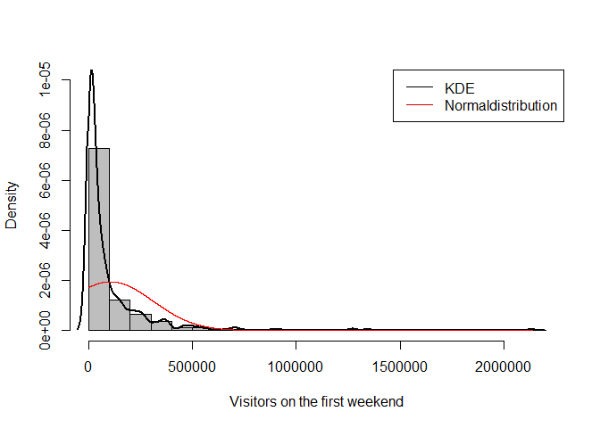
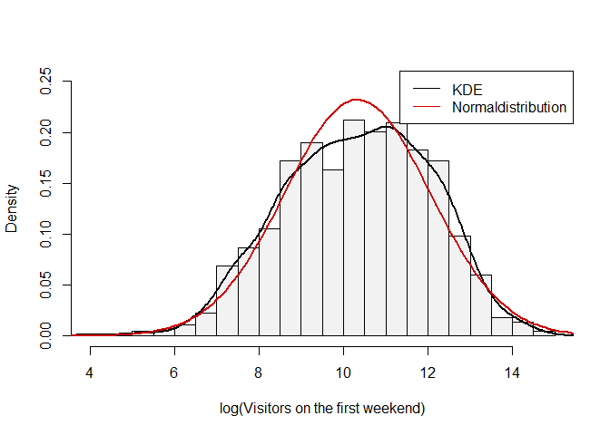
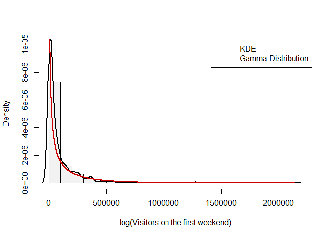
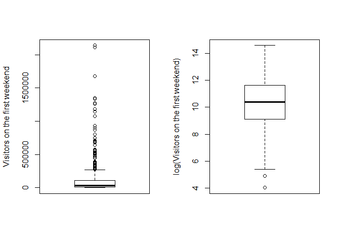
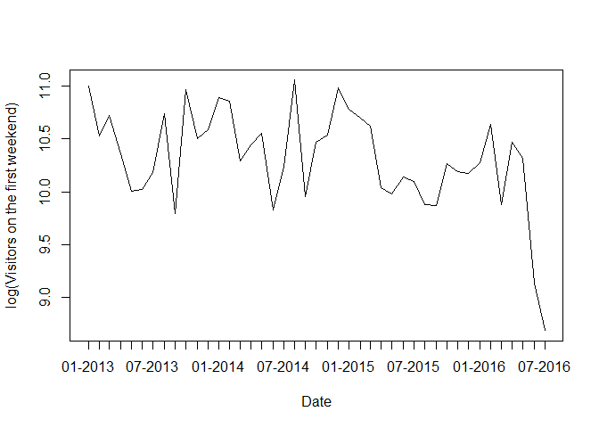
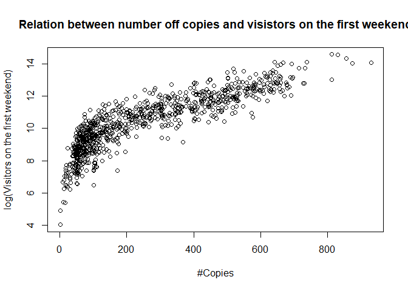
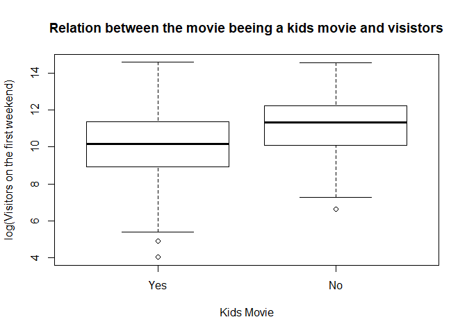
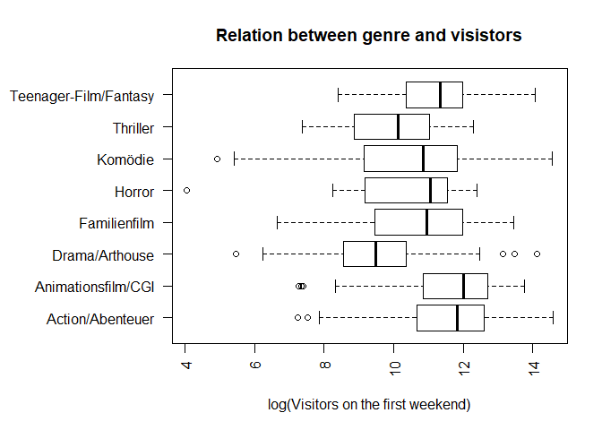
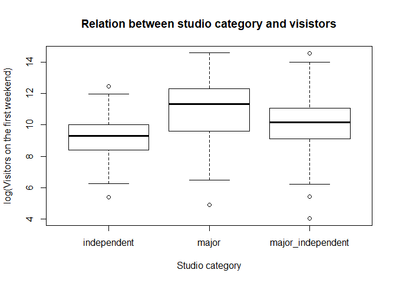

Feature Analyis
================

***This notebook mainly shows the distribution of the target feature and
the relation between the target and the most critical features***

Load the required packages and the dataset

``` r
require(MASS)
require(goftest)

load("../data/data_final/data_final.RData")
```

``` r
truehist(data = data_final$Besucher_wochenende1, col = "grey", ylim = c(0, 0.00001), 
         xlab = "Visitors on the first weekend", ylab = "Density")
lines(x = density(data_final$Besucher_wochenende1), col = "black", lwd = 2)
grid = seq(from = 0, to = max(data_final$Besucher_wochenende1), by = 10)
lines(x = grid, y = dnorm(x = grid, mean = mean(data_final$Besucher_wochenende1), 
                          sd = sd(data_final$Besucher_wochenende1)), col = "red")
legend("topright", legend = c("KDE", "Normaldistribution"), col = (c("black", "red3")), lty = 1)
```

<!-- -->

The target obviously isn’t normal distributed. Whereas, the logarithmic
target seems to follow a normal distributionquite well.

``` r
truehist(data = data_final$Besucher_wochenende1_log, col = "grey95", ylim = c(0.00, 0.25), ylab = "Density",
         xlab = "log(Visitors on the first weekend)")
lines(x = density(data_final$Besucher_wochenende1_log), col = "black", lwd = 2)
grid = seq(from = 0, to = max(data_final$Besucher_wochenende1_log) + 1, by = 0.1)
lines(x = grid, y = dnorm(x = grid, mean = mean(data_final$Besucher_wochenende1_log), 
                          sd = sd(data_final$Besucher_wochenende1_log)), col = "red3", lwd = 2)
legend("topright", legend = c("KDE", "Normaldistribution"), col = (c("black", "red3")), lty = 1)
```

<!-- -->

The following tests check for normal distribution of the untransformed
target:

``` r
fit_normal = fitdistr(x = data_final$Besucher_wochenende1, densfun = "normal")
# Kolmogorov-Smirnov-Test:
ks.test(x = data_final$Besucher_wochenende1, y = "pnorm", mean = fit_normal$estimate[1], sd = fit_normal$estimate[2],
        exact = TRUE)
```

    ## Warning in ks.test(x = data_final$Besucher_wochenende1, y = "pnorm", mean = fit_normal$estimate[1], : ties should not be
    ## present for the Kolmogorov-Smirnov test

    ## 
    ##  One-sample Kolmogorov-Smirnov test
    ## 
    ## data:  data_final$Besucher_wochenende1
    ## D = 0.30346, p-value = 1.388e-14
    ## alternative hypothesis: two-sided

``` r
# Anderson-Darling-Test:
ad.test(x = data_final$Besucher_wochenende1, null = "pnorm", mean = fit_normal$estimate[1], sd = fit_normal$estimate[2])
```

    ## 
    ##  Anderson-Darling test of goodness-of-fit
    ##  Null hypothesis: Normal distribution
    ##  with parameters mean = 105145.583705357, sd = 204264.868494528
    ## 
    ## data:  data_final$Besucher_wochenende1
    ## An = Inf, p-value = 6.696e-07

``` r
# Cramer-von-Mises-Test:
cvm.test(x = data_final$Besucher_wochenende1, null = "pnorm", 
         mean = fit_normal$estimate[1], sd = fit_normal$estimate[2])
```

    ## 
    ##  Cramer-von Mises test of goodness-of-fit
    ##  Null hypothesis: Normal distribution
    ##  with parameters mean = 105145.583705357, sd = 204264.868494528
    ## 
    ## data:  data_final$Besucher_wochenende1
    ## omega2 = 24.446, p-value = 1.443e-06

None of these test result in a p-value less than 0.05. Therefore, the
Null hypothesis can be declined for all of these tests and with it the
assumption of the untransformed target feature following a normal
distribution.

Let’s have a look on the logarithmic target feature:

``` r
fit_lognormal = fitdistr(x = data_final$Besucher_wochenende1, densfun = "lognormal")
# Kolmogorov-Smirnov-Test:
ks.test(x = data_final$Besucher_wochenende1_log, y = "pnorm", 
        mean = fit_lognormal$estimate[1], sd = fit_lognormal$estimate[2], exact = TRUE)
```

    ## Warning in ks.test(x = data_final$Besucher_wochenende1_log, y = "pnorm", : ties should not be present for the
    ## Kolmogorov-Smirnov test

    ## 
    ##  One-sample Kolmogorov-Smirnov test
    ## 
    ## data:  data_final$Besucher_wochenende1_log
    ## D = 0.037118, p-value = 0.1651
    ## alternative hypothesis: two-sided

``` r
# Anderson-Darling-Test:
ad.test(x = data_final$Besucher_wochenende1_log, null = "pnorm", 
        mean = fit_lognormal$estimate[1], sd = fit_lognormal$estimate[2])
```

    ## 
    ##  Anderson-Darling test of goodness-of-fit
    ##  Null hypothesis: Normal distribution
    ##  with parameters mean = 10.3307815957388, sd = 1.7178039411094
    ## 
    ## data:  data_final$Besucher_wochenende1_log
    ## An = 1.8728, p-value = 0.108

``` r
# Cramer-von-Mises-Test:
cvm.test(x = data_final$Besucher_wochenende1_log, null = "pnorm", 
         mean = fit_lognormal$estimate[1], sd = fit_lognormal$estimate[2])
```

    ## 
    ##  Cramer-von Mises test of goodness-of-fit
    ##  Null hypothesis: Normal distribution
    ##  with parameters mean = 10.3307815957388, sd = 1.7178039411094
    ## 
    ## data:  data_final$Besucher_wochenende1_log
    ## omega2 = 0.30105, p-value = 0.1342

In this case all of the tests have a p-value above 0.05, which leads to
an acceptance of the Null hypothesis and confirms the impressions of the
upper plots. The target feature seems to follow a log-normal
distribution to a statistically siginifcant degree.

A final test should also take the gamma distribution into consideration,
which seems to fit the distribution of the target very well if one takes
a look at the following plot:

``` r
shape = mean(data_final$Besucher_wochenende1) ^ 2 / var(data_final$Besucher_wochenende1)
scale = var(data_final$Besucher_wochenende1) / mean(data_final$Besucher_wochenende1)
truehist(data = data_final$Besucher_wochenende1, col = "grey95", ylim = c(0.00, 0.00001), ylab = "Density",
         xlab = "log(Visitors on the first weekend)")
lines(x = density(data_final$Besucher_wochenende1), col = "black", lwd = 2)
grid = seq(from = 0, to = max(data_final$Besucher_wochenende1) + 1, by = 10)
lines(x = grid, y = dgamma(x = grid, shape = shape, scale = scale), col = "red3", lwd = 2)
legend("topright", legend = c("KDE", "Gamma Distribution"), col = (c("black", "red3")), lty = 1)
```

<!-- -->

Applying the three tests results in the following ouputs:

``` r
shape = mean(data_final$Besucher_wochenende1) ^ 2 / var(data_final$Besucher_wochenende1)
scale = var(data_final$Besucher_wochenende1) / mean(data_final$Besucher_wochenende1)
fit_gamma = fitdistr(x = data_final$Besucher_wochenende1, densfun = "gamma", start = list(shape = shape, scale = scale))
```

    ## Warning in sqrt(diag(vc)): NaNs wurden erzeugt

``` r
# Kolmogorov-Smirnov-Test:
ks.test(x = data_final$Besucher_wochenende1, y = "pgamma", shape = fit_gamma$estimate[1], scale = fit_gamma$estimate[2],
        exact = TRUE)
```

    ## Warning in ks.test(x = data_final$Besucher_wochenende1, y = "pgamma", shape = fit_gamma$estimate[1], : ties should not
    ## be present for the Kolmogorov-Smirnov test

    ## 
    ##  One-sample Kolmogorov-Smirnov test
    ## 
    ## data:  data_final$Besucher_wochenende1
    ## D = 0.13046, p-value = 1.034e-13
    ## alternative hypothesis: two-sided

``` r
# Anderson-Darling-Test:
ad.test(x = data_final$Besucher_wochenende1, null = "pgamma", 
        shape = fit_gamma$estimate[1], scale = fit_gamma$estimate[2])
```

    ## 
    ##  Anderson-Darling test of goodness-of-fit
    ##  Null hypothesis: Gamma distribution
    ##  with parameters shape = 0.399973613325514, scale = 397265.905364349
    ## 
    ## data:  data_final$Besucher_wochenende1
    ## An = 34.643, p-value = 6.696e-07

``` r
# Cramer-von Mises-Test:
cvm.test(x = data_final$Besucher_wochenende1, null = "pgamma", 
         scale = fit_gamma$estimate[1], shape = fit_gamma$estimate[2])
```

    ## 
    ##  Cramer-von Mises test of goodness-of-fit
    ##  Null hypothesis: Gamma distribution
    ##  with parameters scale = 0.399973613325514, shape = 397265.905364349
    ## 
    ## data:  data_final$Besucher_wochenende1
    ## omega2 = 161.65, p-value = 0.02323

The Null hypothesis can be declined. Although, the p-values of all tests
are above the p-values of the tests for normal distribution they are
still far below a significant level of 0.05 which leads to the
assumption that the target features does not follow a gamma
distribution.

Therefore, for all further descriptive analysis the logarithmic target
feature will be used.

``` r
# Boxlpots
par(mfrow = c(1, 2))
boxplot(x = data_final$Besucher_wochenende1, ylab = "Visitors on the first weekend")
boxplot(x = data_final$Besucher_wochenende1_log, ylab = "log(Visitors on the first weekend)")
```

<!-- -->

``` r
par(mfrow = c(1, 1))
```

Also the boxplots of the untranformed and the logarithmic target
varaible depict a much more balanced image of the logarithmic feature
with much less outliers than the untransformed target.

``` r
t_mon = as.POSIXlt(data_final$Kinostart)$mon + 1
t_y = as.POSIXlt(data_final$Kinostart)$year + 1900
t = as.Date(paste0(t_mon, "-", t_y, "01"), format = "%m-%Y%d")
tmp = aggregate(data_final$Besucher_wochenende1_log, by = list(t), mean)
colnames(tmp) = c("Date", "Visitors_log")
plot(tmp$Visitors_log ~ tmp$Date, type = "l", xaxt = "n", ylab =  "log(Visitors on the first weekend)", xlab = "Date")
axis.Date(side = 1, at = tmp$Date, format = "%m-%Y")
```

<!-- -->

The developement of the target over time clearly shows a seasonal trend
with peaks in winter and drops in spring and summer. The final drop on
summer of 2016 is due to the fact that the dataset does not contain as
much movies for July 2016 as it does for the other months and therefore
the monthly mean of July 2016 is more sensitive to outliers.

``` r
plot(x = data_final$Kopien, y = data_final$Besucher_wochenende1_log,
     main = "Relation between number off copies and visistors on the first weekend", xlab = "#Copies", 
     ylab = "log(Visitors on the first weekend)")
```

<!-- -->

The upper plot shows a clear relation between number of copies and the
target feature. Obviously, this relation is not linear which should be
taken into account if one includes this feature into her model.

``` r
plot(x = data_final$Kinderfilm, y = data_final$Besucher_wochenende1_log,
     main = "Relation between the movie beeing a kids movie and visistors", 
     ylab = "log(Visitors on the first weekend)", xlab = "Kids Movie",  names = c("Yes", "No"))
```

<!-- -->

Also there seems to be a relation between the movie beeing a Kids Movie
or not. Whereby, Kids Movies usually attract less visitors that Non Kids
Movies.

``` r
par(mar = c(5, 10, 4, 2))
plot(x = data_final$Genre_Prognose, y = data_final$Besucher_wochenende1_log, horizontal=TRUE, las=2,
     main = "Relation between genre and visistors", xlab = "log(Visitors on the first weekend)", ylab = "")
```

<!-- -->

If one takes a look at the relation between the visitors of a movie an
its genre two points are highly remarkable: Thrillers and especially
Drama and Arthouse movies seem to attract much less visitors than the
other movie genres. On the other hand Action/Adventure movies and CGI
movies seem to attract much more than the average movie. The remaining
genres seem to attract an average number ob people with almost no
outliers in the tranformed target.

The plot below shows the relation between the category of the stuio and
the target feature. Unsurprisingly bigger studios tent to release movies
which attract a greater amount of visitors than the smaller independent
studios.

``` r
plot(x = data_final$Verleiherkategorie, y = data_final$Besucher_wochenende1_log,
     main = "Relation between studio category and visistors",
     ylab = "log(Visitors on the first weekend)", xlab = "Studio category")
```

<!-- -->
