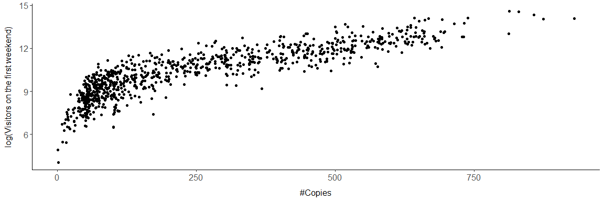
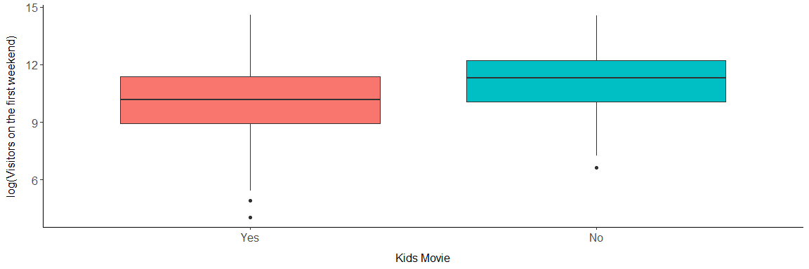
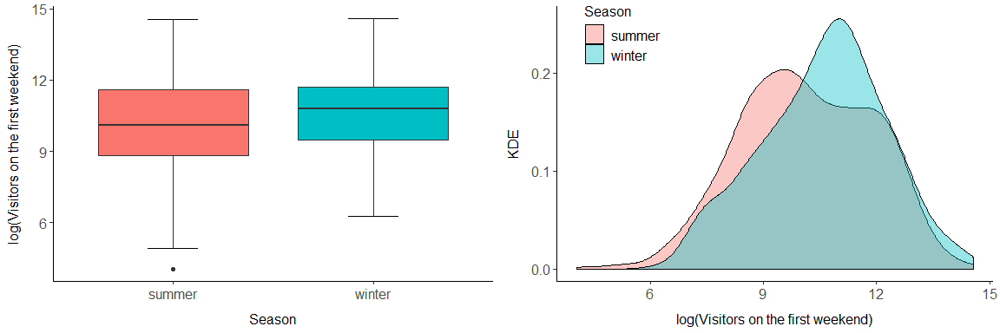
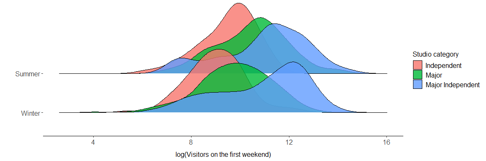

Movie Feature Analyis
================

***This notebook mainly shows the relation between the target and the
most critical features of a movie***

``` r
require(MASS)
require(ggridges)
require(goftest)

load("../data/data_final.RData")
source("../utils/plotting_utils.R")
```

``` r
ggplot(data = data_final, mapping = aes(x = copies, y = visitors_premiere_weekend_log)) + geom_point() + 
  labs(x = "#Copies", y = "log(Visitors on the first weekend)") + stat_con
```

<!-- -->

The upper plot shows a clear relation between number of copies and the
target feature. The number of copies usually reffers to the number of
cinemas in which the movie is shown. Obviously, this relation is not
linear which should be taken into account if one includes this feature
into her model.

``` r
ggplot(data = data_final, mapping = aes(x = kids_movie, y = visitors_premiere_weekend_log, fill = kids_movie)) +
  geom_boxplot() + labs(x = "Kids Movie", y = "log(Visitors on the first weekend)") + stat_con + 
  scale_x_discrete(labels = c("Yes", "No")) + theme(legend.position = "none")
```

<!-- -->

Also, there seems to be a relation between the movie beeing a Kids Movie
or not. Whereby, Kids Movies usually attract less visitors that Non Kids
Movies.

``` r
ggplot(data = data_final, mapping = aes(x = genre, y = visitors_premiere_weekend_log, fill = genre)) + geom_boxplot() +
  labs(x = "Genre", y = "log(Visitors on the first weekend)") + stat_con + theme(legend.position = "none")
```

<!-- -->

If one takes a look at the relation between the visitors of a movie an
its genre two points are highly remarkable: Thrillers and especially
Drama and Arthouse movies seem to attract much less visitors than the
other movie genres. On the other hand Action/Adventure movies and CGI
movies seem to attract much more than the average movie. The remaining
genres seem to attract an average number ob people with almost no
outliers in the tranformed target.

The plot below shows the relation between the category of the stuio and
the target feature. Unsurprisingly bigger studios tent to release movies
which attract a greater amount of visitors than the smaller independent
studios. Especially the movies released by small independent studios
rarely attract more than 800000 people. The medians of the visitors at
the premiere weekend are log(9.29) = 10829 for independen studios,
log(10.1) = 24343 for major independent studios and log(11.3) = 80821
for major studios. This obviously seems to have a high impact on the
amount of people watching a movie.

``` r
data_final$studio <- factor(data_final$studio, levels=names(sort(table(data_final$studio), decreasing=FALSE)))

plot1 <- ggplot(data = data_final, mapping = aes(x = studio, y = visitors_premiere_weekend_log, fill = studio)) + 
  stat_boxplot(geom = "errorbar", width = .25) + geom_boxplot() +
        labs(x = "Studio category", y = "log(Visitors on the first weekend)") + stat_con + 
        scale_x_discrete(labels = c("Independent", "Major Ind.", "Major")) + theme(legend.position = "none") 

plot2 <- ggplot(aes(x = visitors_premiere_weekend_log, fill = studio), data = data_final) + 
  geom_density(alpha = .4) + labs(x = "log(Visitors on the first weekend)", y = "KDE") + stat_con + 
  theme(legend.position = c(0.25, 0.85), legend.background=element_rect(fill="transparent",colour=NA),
        legend.key=element_rect(fill="transparent",colour=NA)) +
        scale_fill_discrete("Studio category", labels = c("Independent", "Major Ind.", "Major"))

grid.arrange(plot1, plot2, ncol = 2)
```

<!-- -->

If it comes to seasonal impact a difference between summer and winter is
the first thing that comes to mind.

``` r
plot1 <- ggplot(data = data_final, mapping = aes(x = season, y = visitors_premiere_weekend_log, fill = season)) + 
  stat_boxplot(geom = "errorbar", width = .25) + geom_boxplot() + 
  labs(x = "Season", y = "log(Visitors on the first weekend)") + stat_con + theme(legend.position = "none")

plot2 <- ggplot(aes(x = visitors_premiere_weekend_log, fill = season), data = data_final) + 
  geom_density(alpha = .4) + labs(x = "log(Visitors on the first weekend)", y = "KDE") + stat_con + 
  theme(legend.position = c(0.15, 0.9)) + scale_fill_discrete("Season")

grid.arrange(plot1, plot2, ncol = 2)
```

<!-- -->

The plot confirms this assumption. The median of the visitors of a movie
at its premiere weekend of movies released during summer is log(10.1) =
24343, whereby on the other hand this value of movies released during
winter months is log(10.6) = 40134 which is almost twice as high.
Looking at the tails of the distribution one sees that especially the
marginal distsribbution of movies released during summer is heavier
tailed on the left side compared to the density of movies released
during winter. Obviously the seasonal influence affects smaller movies
more than it affects blockbusters.

``` r
ggplot(data = data_final, aes(y = season)) + geom_density_ridges(aes(x = visitors_premiere_weekend_log, fill=studio),
                      alpha = .8, color = "black") + labs(x = "log(Visitors on the first weekend)", y = "") + 
  scale_fill_discrete("Studio category", labels=c("Independent", "Major", "Major Independent")) + 
  scale_y_discrete("", labels=c("Winter", "Summer")) + stat_con + theme(axis.line.y = element_blank())
```

<!-- -->

Plotting the target in dependency of studio and the season in a combined
plot the conclusion made above is confirmed. While the overall density
of moviegoers during summer seems to have a higher mass on lower
numbers, the discrepancy of the success of movies released by independet
and major studios is greater during the winter months. Interestingly
enough there appears to be a bunch of unsuccesfull movies realeased by
major studios during summer, which is shown in the smaller peak of the
density of movies released by major studios during summer. Obviously
major studios shoudl release their movies during the winter months,
while independent studios should release them during the summer months
if they want them to be succesfull.
