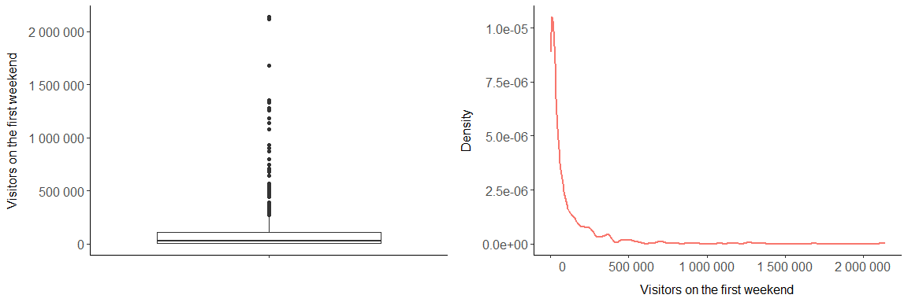
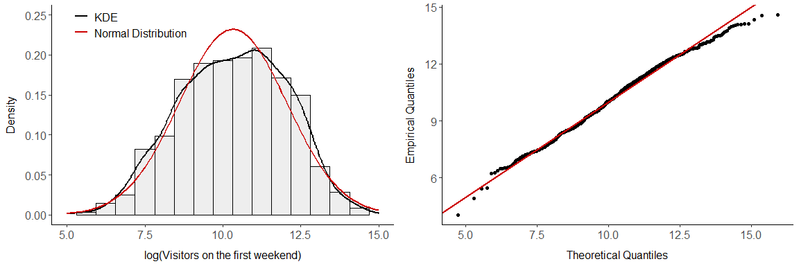
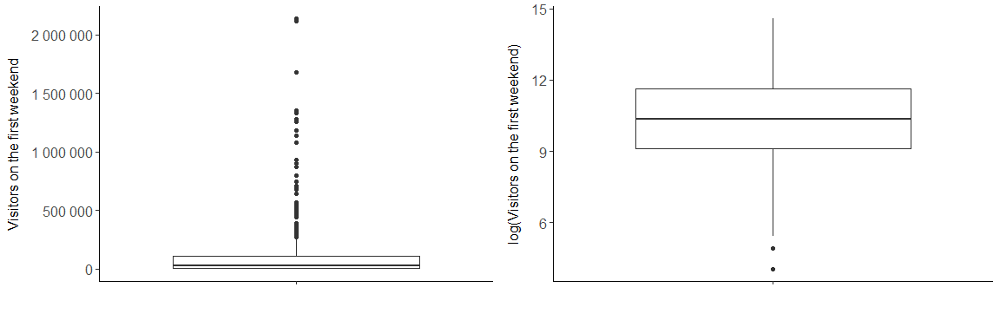
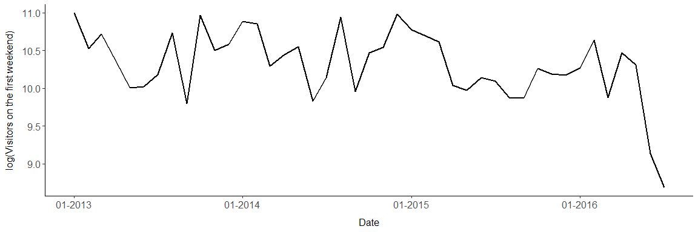

Target Analyis
================

***This notebook mainly shows the distribution of the target feature and
tests for different distributions if the target feature follows this
distributions***

``` r
require(MASS)
require(goftest)

load("../data/data_final.RData")
source("../utils/plotting_utils.R")
```

``` r
plot1 <- ggplot(aes(x = "", y = visitors_premiere_weekend), data = data_final) + geom_boxplot() +
  labs(y = "Visitors on the first weekend", x = "") +
  stat_con + scale_y_continuous(labels = thousand_dot)

plot2 <- ggplot(aes(x = visitors_premiere_weekend), data = data_final) + 
        stat_density(mapping = aes(color = "KDE"), geom = "line", size = 1) +
        labs(y = "Density", x = "Visitors on the first weekend") + stat_con + theme(legend.position = "none") +
        scale_x_continuous(labels = thousand_dot)

grid.arrange(plot1, plot2, ncol = 2)
```

<!-- -->

The target obviously isn’t normal distributed. The 25% quantile of the
target is 8952, the median is at 31764 and the 75% quantile is 112607,
whereas the maximum value is 2138869 visitors. Whereas, the logarithmic
target seems to follow a normal distributionquite well.

``` r
nbins <- nclass.scott(data_final$visitors_premiere_weekend_log)
mean <- mean(data_final$visitors_premiere_weekend_log)
sd <- sd(data_final$visitors_premiere_weekend_log)
plot1 <- ggplot(aes(x = visitors_premiere_weekend_log), data = data_final) + 
        geom_histogram(aes(x = visitors_premiere_weekend_log, y = ..density..), 
                       color = "black", bins = nbins, alpha = 0.1) +
        stat_density(mapping = aes(color = "KDE"), geom = "line", size = 1) + 
        stat_function(fun = dnorm, size = 1, mapping = aes(color = "Normal Distribution"),
                      args = list(mean = mean, sd = sd)) + 
        labs(y = "Density", x = "log(Visitors on the first weekend)") + ylim(c(0.00, 0.25)) + stat_con +
        scale_color_manual(name = "", values = c("black", "red3")) + 
        theme(legend.position = c(0.23, 0.95)) + scale_x_continuous(limits = c(5, 15))

plot2 <- ggplot(data = data_final, mapping = aes(sample = visitors_premiere_weekend_log)) + 
        stat_qq(dparams = list(mean = mean, sd = sd)) +geom_abline(slope = 1, intercept = 0, color = "red3", size = 1) +
        stat_con + scale_x_continuous(breaks = seq(from = 5, to = 15, by = 2.5)) +
        labs(x = "Theoretical Quantiles", y = "Empirical Quantiles") 
grid.arrange(plot1, plot2, ncol = 2)
```

<!-- --> To
get a normal distribution the target variable is log transformed. The
plots above show, that the log transformed taget variable seems to
follow a normal distributiion quie well which is confirmed by the
following tests.

The following tests check for normal distribution of the untransformed
target:

``` r
fit_normal <- fitdistr(x = data_final$visitors_premiere_weekend, densfun = "normal")
# Kolmogorov-Smirnov-Test:
ks.test(x = data_final$visitors_premiere_weekend, y = "pnorm", mean = fit_normal$estimate[1], 
        sd = fit_normal$estimate[2], exact = TRUE)
```

    ## 
    ##  One-sample Kolmogorov-Smirnov test
    ## 
    ## data:  data_final$visitors_premiere_weekend
    ## D = 0.30368, p-value = 1.177e-14
    ## alternative hypothesis: two-sided

``` r
# Anderson-Darling-Test:
ad.test(x = data_final$visitors_premiere_weekend, null = "pnorm", mean = fit_normal$estimate[1],
        sd = fit_normal$estimate[2])
```

    ## 
    ##  Anderson-Darling test of goodness-of-fit
    ##  Null hypothesis: Normal distribution
    ##  with parameters mean = 104927.865256125, sd = 204089.338479246
    ## 
    ## data:  data_final$visitors_premiere_weekend
    ## An = Inf, p-value = 6.682e-07

``` r
# Cramer-von-Mises-Test:
cvm.test(x = data_final$visitors_premiere_weekend, null = "pnorm", 
         mean = fit_normal$estimate[1], sd = fit_normal$estimate[2])
```

    ## 
    ##  Cramer-von Mises test of goodness-of-fit
    ##  Null hypothesis: Normal distribution
    ##  with parameters mean = 104927.865256125, sd = 204089.338479246
    ## 
    ## data:  data_final$visitors_premiere_weekend
    ## omega2 = 24.542, p-value = 1.505e-06

None of these test result in a p-value less than 0.05. Therefore, the
Null hypothesis can be declined for all of these tests and with it the
assumption of the untransformed target feature following a normal
distribution.

Let’s have a look on the logarithmic target feature:

``` r
fit_lognormal <- fitdistr(x = data_final$visitors_premiere_weekend_log, densfun = "lognormal")
# Kolmogorov-Smirnov-Test:
ks.test(x = data_final$visitors_premiere_weekend_log, y = "pnorm", 
        mean = fit_lognormal$estimate[1], sd = fit_lognormal$estimate[2], exact = TRUE)
```

    ## 
    ##  One-sample Kolmogorov-Smirnov test
    ## 
    ## data:  data_final$visitors_premiere_weekend_log
    ## D = 1, p-value = 1.177e-14
    ## alternative hypothesis: two-sided

``` r
# Anderson-Darling-Test:
ad.test(x = data_final$visitors_premiere_weekend_log, null = "pnorm", 
        mean = fit_lognormal$estimate[1], sd = fit_lognormal$estimate[2])
```

    ## 
    ##  Anderson-Darling test of goodness-of-fit
    ##  Null hypothesis: Normal distribution
    ##  with parameters mean = 2.32009162910613, sd = 0.174935631538614
    ## 
    ## data:  data_final$visitors_premiere_weekend_log
    ## An = Inf, p-value = 6.682e-07

``` r
# Cramer-von-Mises-Test:
cvm.test(x = data_final$visitors_premiere_weekend_log, null = "pnorm", 
         mean = fit_lognormal$estimate[1], sd = fit_lognormal$estimate[2])
```

    ## 
    ##  Cramer-von Mises test of goodness-of-fit
    ##  Null hypothesis: Normal distribution
    ##  with parameters mean = 2.32009162910613, sd = 0.174935631538614
    ## 
    ## data:  data_final$visitors_premiere_weekend_log
    ## omega2 = 299.33, p-value < 2.2e-16

In this case all of the tests have a p-value above 0.05, which leads to
an acceptance of the Null hypothesis and confirms the impressions of the
upper plots. The target feature seems to follow a log-normal
distribution to a statistically siginifcant degree.

A final test should also take the gamma distribution into consideration,
which seems to fit the distribution of the target very well if one takes
a look at the following plot:

``` r
nbins <- nclass.scott(data_final$visitors_premiere_weekend)
shape <- mean(data_final$visitors_premiere_weekend) ^ 2 / var(data_final$visitors_premiere_weekend)
scale <- var(data_final$visitors_premiere_weekend) / mean(data_final$visitors_premiere_weekend)
ggplot(aes(x = visitors_premiere_weekend), data = data_final) + 
  geom_histogram(aes(x = visitors_premiere_weekend, y = ..density..), color = "black", bins = nbins, alpha = 0.1) +
  stat_density(mapping = aes(color = "KDE"), geom = "line", size = 1) + 
  stat_function(fun = dgamma, size = 1, mapping = aes(color = "Gamma Distribution"), 
                args = list(shape = shape, scale = scale)) + 
  labs(y = "Density", x = "Visitors on the first weekend") + stat_con +
  xlim(-1, max(data_final$visitors_premiere_weekend)) +
  scale_color_manual(name = "", values = c("red3", "black")) + theme(legend.position = c(0.23, 0.95))
```

<!-- -->

Applying the three tests results in the following ouputs:

``` r
shape <- mean(data_final$visitors_premiere_weekend) ^ 2 / var(data_final$visitors_premiere_weekend)
scale <- var(data_final$visitors_premiere_weekend) / mean(data_final$visitors_premiere_weekend)
fit_gamma <- fitdistr(x = data_final$visitors_premiere_weekend, densfun = "gamma", 
                     start = list(shape = shape, scale = scale))
# Kolmogorov-Smirnov-Test:
ks.test(x = data_final$visitors_premiere_weekend, y = "pgamma", shape = fit_gamma$estimate[1], 
        scale = fit_gamma$estimate[2], exact = TRUE)
```

    ## 
    ##  One-sample Kolmogorov-Smirnov test
    ## 
    ## data:  data_final$visitors_premiere_weekend
    ## D = 0.13072, p-value = 9.259e-14
    ## alternative hypothesis: two-sided

``` r
# Anderson-Darling-Test:
ad.test(x = data_final$visitors_premiere_weekend, null = "pgamma", 
        shape = fit_gamma$estimate[1], scale = fit_gamma$estimate[2])
```

    ## 
    ##  Anderson-Darling test of goodness-of-fit
    ##  Null hypothesis: Gamma distribution
    ##  with parameters shape = 0.399473687990772, scale = 397405.332987416
    ## 
    ## data:  data_final$visitors_premiere_weekend
    ## An = 34.94, p-value = 6.682e-07

``` r
# Cramer-von Mises-Test:
cvm.test(x = data_final$visitors_premiere_weekend, null = "pgamma", 
         scale = fit_gamma$estimate[1], shape = fit_gamma$estimate[2])
```

    ## 
    ##  Cramer-von Mises test of goodness-of-fit
    ##  Null hypothesis: Gamma distribution
    ##  with parameters scale = 0.399473687990772, shape = 397405.332987416
    ## 
    ## data:  data_final$visitors_premiere_weekend
    ## omega2 = 162.09, p-value = 0.02337

The Null hypothesis can be declined. Although, the p-values of all tests
are above the p-values of the tests for normal distribution they are
still far below a significant level of 0.05 which leads to the
assumption that the target features does not follow a gamma
distribution.

Therefore, for all further descriptive analysis the logarithmic target
feature will be used.

``` r
plot1 <- ggplot(aes(x = "", y = visitors_premiere_weekend), data = data_final) + geom_boxplot() +
  labs(y = "Visitors on the first weekend", x = "") +
  stat_con + scale_y_continuous(labels = thousand_dot)

plot2 <- ggplot(aes(x = "", y = visitors_premiere_weekend_log), data = data_final) + geom_boxplot() +
  labs(y = "log(Visitors on the first weekend)", x = "") +
  stat_con + scale_y_continuous(labels = thousand_dot)

grid.arrange(plot1, plot2, ncol = 2)
```

<!-- -->

Also the boxplots of the untranformed and the logarithmic target
varaible depict a much more balanced image of the logarithmic feature
with much less outliers than the untransformed target.

``` r
t_mon <- as.POSIXlt(data_final$premiere_date)$mon + 1
t_y <- as.POSIXlt(data_final$premiere_date)$year + 1900
t <- as.Date(paste0(t_mon, "-", t_y, "01"), format = "%m-%Y%d")
tmp <- aggregate(data_final$visitors_premiere_weekend_log, by = list(t), mean)
colnames(tmp) <- c("Date", "Visitors_log")
ggplot(data = tmp, aes(x = Date, y = Visitors_log)) + geom_line(size = 1) + stat_con + 
  scale_x_date(date_labels = "%m-%Y") + ylab("log(Visitors on the first weekend)")
```

<!-- -->

The developement of the target over time clearly shows a seasonal trend
with peaks in winter and drops in spring and summer. The final drop on
summer of 2016 is due to the fact that the dataset does not contain as
much movies for July 2016 as it does for the other months and therefore
the monthly mean of July 2016 is more sensitive to outliers.
